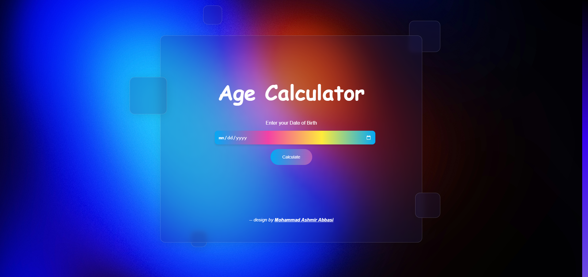
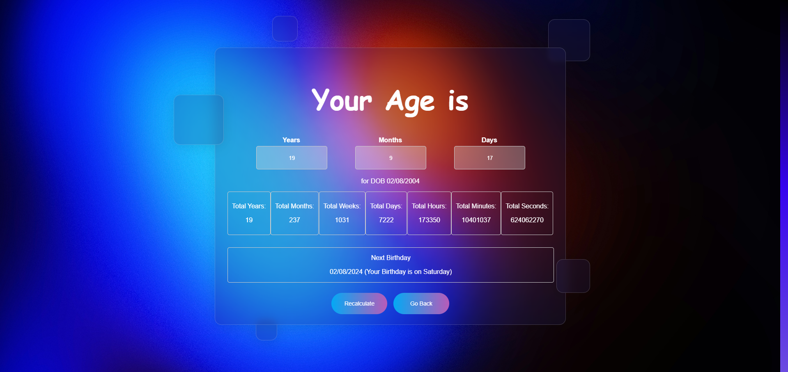

# 🎂 Age Calculator: Calculate Your Age in Seconds! ⏳

An interactive age calculator built using HTML, CSS, Bootstrap 5, and JavaScript.

## Calculator Preview

## Result Preview

## Features
- Enter your birthdate to calculate your age.
- Glassmorphism design for a sleek look.
- Icons representing the technologies used:
  - 💡 HTML5
  - 🎨 CSS3
  - 🅱️ Bootstrap 5
  - 🚀 JavaScript

## Usage
1. Open link given below in your browser.
2. Enter your birthdate in the format "MM/DD/YYYY".
3. Click the "Calculate" button to see your age.

## Contributing
Contributions are welcome! Fork this repository and submit a pull request.

## Credits
- Inspired by Glassmorphism UI

### Live Preview
https://mohammadashmir786.github.io/Age_Calculator/ 🚀
